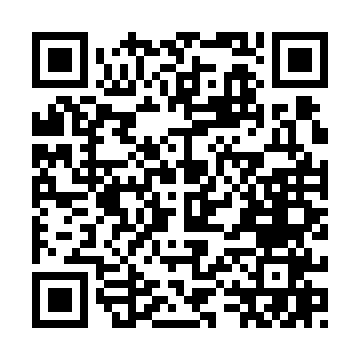

# line-bot-3minute-music

> [!WARNING]
> BOTは現在稼働していません


## DEMO
  
### QR
  


## Setup
### .envの作成・設定
`cp ./src/.env.example ./src/.env`

#### LINE
[LINE Developers](
https://developers.line.biz/ja/docs/messaging-api/getting-started/)からMessaging APIの`CHANNEL_ACCESS_TOKEN/CHANNEL_SECRET`を取得  
```
# .env
LINE_CHANNEL_ACCESS_TOKEN=""
LINE_CHANNEL_SECRET=""
```

#### Spotify
[Spotify for Developers](https://developer.spotify.com/dashboard/)からアプリケーションの`CLIENT_ID/CLIENT_SECRET`を取得  
```
# .env
SPOTIFY_CLIENT_ID=""
SPOTIFY_CLIENT_SECRET=""
```

### Webhookの設定
サーバーを外部に公開して、LINE Messaging APIにWebhook URLを設定
#### ngrokを用いる場合
1. [ngrok dashboard](https://dashboard.ngrok.com/get-started/your-authtoken)からAuthtokenを取得  
    ```
    # .env
    NGROK_AUTH=""
    ```
2. コンテナを実行
    ```
    $ docker-compose up -d
    ```
3. http://localhost:4040 から公開URLを取得
4. [LINE Messaging APIにWebhook URLを設定](https://developers.line.biz/ja/docs/messaging-api/building-bot/#setting-webhook-url)<br>`https://xxxx/api/webhook`


## Usage
1. コンテナを実行
```
$ docker-compose up -d
```
2. composer install
```
$ docker exec -it line_bot_php bash
$ composer install
```
3. laravel key generate
```
$ php artisan key:generate
```
4. 音楽を取得
```
$ php artisan schedule:work
```
5. [「Webhookの設定」](#webhookの設定)で設定した LINE BOTに「getMusic!!」を発話
